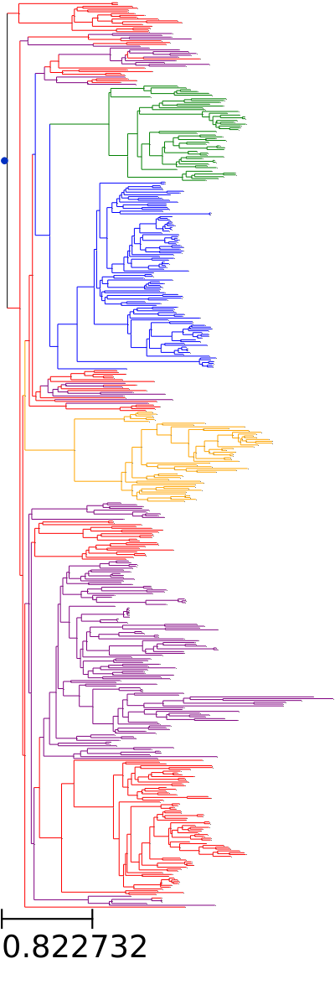

# phylogenetic_blocking
A repository holding some code for conducting phylogenetic blocking using ete3

# Outline

Some code to break a phylogeny into groups of related-ish organisms for performing phylogenetic cross-validation procedures.

[Here's a paper that explains why you might want to do this.](https://nsojournals.onlinelibrary.wiley.com/doi/pdfdirect/10.1111/ecog.02881)

## Method

A distance matrix extracted from the leaves of a specified newick tree is used to construct clusters of phylogenetically related organisms after performing MDS - this is done because it is 
often difficult to separate a relatively unbalanced phylogeny into 5 (or more) completely monophyletic and also evenly-sized groups.

The `get_distance` function implemented in ete3 is extremely slow - this code uses some tricks to quickly extract a distance matrix from large-ish trees (~10,000 leaves).  

## Usage

```
usage: cli.py [-h] --tree TREE --n-folds N_FOLDS --output OUTPUT

options:
  -h, --help            show this help message and exit
  --tree TREE, -t TREE
  --n-folds N_FOLDS, -n N_FOLDS
  --output OUTPUT, -o OUTPUT
```

## Result
An ugly assortment of clades into blocks:  

  

